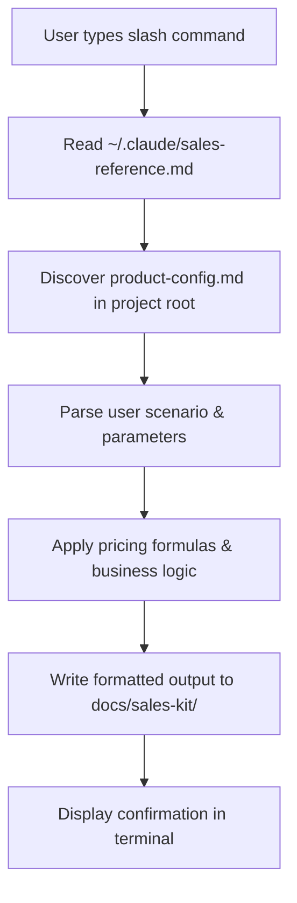

# CLAUDE.md

This file provides guidance to Claude Code (claude.ai/code) when working with code in this repository.

## Project Overview

Claude Sales is a skill/command bundle for Claude Code that provides sales, pricing, and marketing assistance via slash commands. It is not a traditional programming project — it consists of Markdown files containing business logic and templates, plus a Bash installer script.

Users install slash commands (`/sales-get-pricing`, `/sales-get-marketing`, `/sales-get-quotation`) into `~/.claude/commands/` and create a `product-config.md` in their project with YAML-structured product details.

## Installation & Testing

```bash
# Install locally
chmod +x install.sh && ./install.sh

# Verify installation
ls -la ~/.claude/commands/
# Expected: sales-get-pricing.md, sales-get-marketing.md, sales-get-quotation.md
```

There is no build system, test framework, or linter. Validation is manual — install and run the slash commands in Claude Code.

## Architecture

### File Roles

- **`install.sh`** — Bash installer that copies files to `~/.claude/` (reference + template) and `~/.claude/commands/` (slash commands). Supports both local install and remote download from GitHub.
- **`sales-reference.md`** — Core business logic: pricing formulas, response patterns, formatting standards, FAQ patterns. Installed to `~/.claude/`.
- **`product-config-template.md`** — YAML-structured template users copy and customize per project. Installed to `~/.claude/`.
- **`sales-get-pricing.md`** — `/sales-get-pricing` command. Handles scenarios: `license`, `via [channel]`, `[customer-type]`, `for [custom]`. Calculates partner margins (referrer 10%, affiliate 20%, reseller 30%, fronting 15%).
- **`sales-get-marketing.md`** — `/sales-get-marketing` command. Generates taglines, elevator pitch, social media posts, ROI content. Supports styles: casual, professional, problem-solution, behind-the-scenes, punchy.
- **`sales-get-quotation.md`** — `/sales-get-quotation` command. Generates line-item quotations for SME, enterprise, government customer types with optional add-ons and terms.
- **`examples/g8stack-config.md`** — Real-world example config (API Management Platform, MYR currency).

### Data Flow



### Configuration Structure (product-config.md)

Key sections: basic info, pricing (base + add-ons + maintenance + MAP), partner channels with margin percentages, packages/bundles by customer type, marketing copy, FAQs, quotation defaults, and contact info.

## Conventions

- All command files use Markdown with embedded YAML for structured data.
- Pricing outputs use box-drawing characters for formatted tables.
- All workflow and architecture diagrams use MermaidJS (` ```mermaid `) for consistency and rendering support across GitHub, VS Code, and documentation tools.
- The GitHub remote repo name is `claude-sales` (at `nasrulhazim/claude-sales`), though this local directory uses `claude-get-pricing`.
